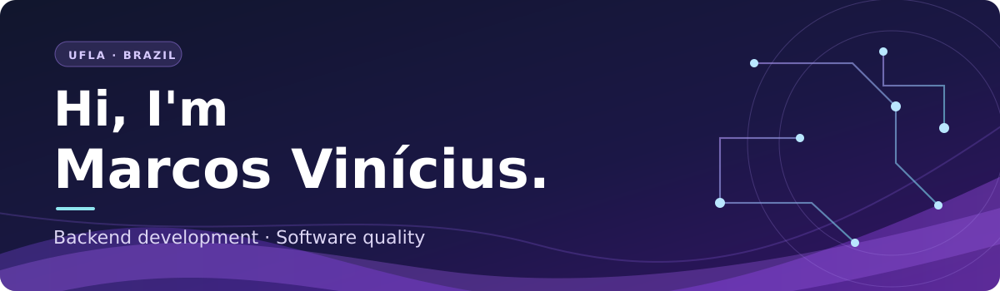

  

I'm a Computer Science undergraduate at the **Federal University of Lavras (UFLA)** and a software developer working on Java systems in an **IMA/UFLA project at Fundecc**. I work with backend development, business rules, and validation of changes. Earlier in the same project, I worked with test automation using Java and Selenium.

I like building clear APIs, understanding the problem behind each requirement, and making software more reliable. I'm interested in **backend internship and junior opportunities**.

## Tech stack

**Backend and data**

**Quality and tools**

**Also used:** JavaScript, Node.js, Python, C++, and Flutter (Dart).

## Selected projects

- **[API Rhaegal](https://github.com/mvk999/zeus-backend)** — Backend API built for Comp Júnior's 2025.1 challenge, covering members, clients, and budgets.
- **[ProjetoGrafos](https://github.com/mvk999/ProjetoGrafos)** — Graph algorithms applied to routing with capacity constraints (CARP).
- **[Brasileirão Predictor](https://github.com/mvk999/brasileirao-predicotr)** — A project for predicting Brazilian league match results.

## Contact

  

